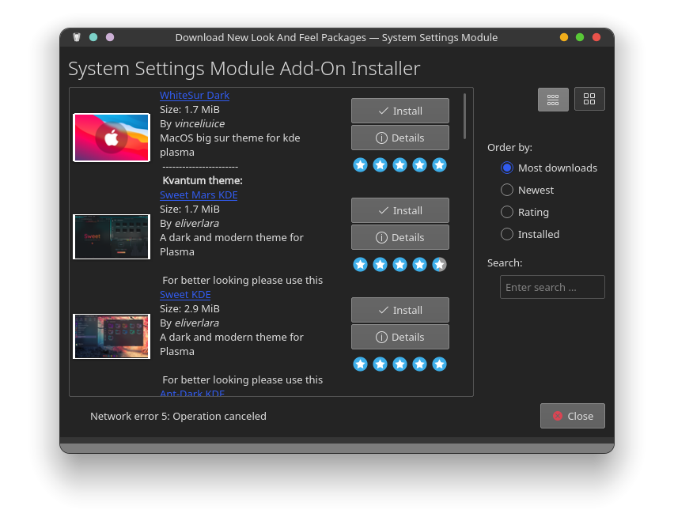
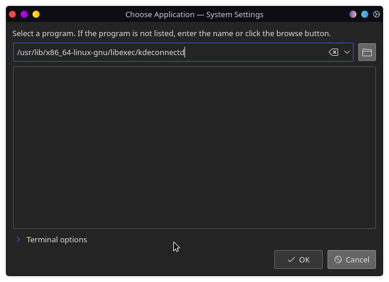

# Debian install docs
This is a personal installation record of the stuff that I did for my debian system

# Basic installation
These are the basic installation steps.

## Theme setup
https://store.kde.org/p/1400424

Check the "Use Desktop Layout from theme" in the Look And feel module. Then add a bottom bar and add the **Icons-only Task bar** widget to it.

### Widgets

* Color picker
* Thermal monitor
* System load viewer

## Terminal

*	install The carl theme
*	install ZSH

```bash
sudo apt install zsh
```
*	install OhMyZsh

```bash  
sh -c "$(curl -fsSL https://raw.githubusercontent.com/ohmyzsh/ohmyzsh/master/tools/install.sh)"
```

*	install Powerline10k

```bash
git clone --depth=1 https://github.com/romkatv/powerlevel10k.git ${ZSH_CUSTOM:-$HOME/.oh-my-zsh/custom}/themes/powerlevel10k
```


## Programs and configs

* ghostwriter, pandoc for git markdown support

```bash
sudo apt install ghostwriter
sudo apt install pandoc
```

* firefox sweet theme
https://github.com/EliverLara/firefox-sweet-theme

* ckb - for corsair keyboards, manual build
fixed dependency issues with aptitude

* gotop - sexy graphs

* spotify - with mods ;)

1. install spotify  
2. install the addblocker https://github.com/SecUpwN/Spotify-AdKiller
3. install spicetify https://github.com/khanhas/spicetify-cli/wiki/Installation#with-shell-pre-built-binary  
themes are located at `~/spicetify-cli/Themes`
4. install the theme pack https://github.com/morpheusthewhite/spicetify-themes
5. select the theme that you like `spicetify config current_theme <THEME_NAME>`
6. you can enable devtools lp `spicetify enable-devtool`

## Random fixes

### Disk mounting

* Find the UUID of the disk that you want to mount

```
sudo blkid
```

* add the disk to `/etc/fstab`

```
echo "UUID=<uuid> <mount_point> <disk_format> defaults 0 0"
```


### Nvidia driver install
https://wiki.debian.org/NvidiaGraphicsDrivers

Install linux headers
```bash  
sudo apt install linux-headers-amd64

```

add to `/etc/apt/sources.list`:

```
# buster-backports
deb http://deb.debian.org/debian buster-backports main contrib non-free
```

install buster and nvidia drivers

```bash
sudo apt update
sudo apt install -t buster-backports nvidia-driver 
sudo reboot  
```

if screen tearing https://www.cmscritic.com/how-to-fix-nvidia-screen-tearing-in-xfce-mate-kde-lxde-and-others/
	
### Start KDE Connect on boot

Go to `System settings > Startup and Shutdown > Autostart > Add Program`

And paste in `/usr/lib/x86_64-linux-gnu/libexec/kdeconnectd`



### Stream single monitor to discord

https://github.com/ShayBox/Mon2Cam

### Lutris Ubisoft Connect no internet

The prolem was that `libgnutls30` was not installed for 32bit

```bash  
sudo dpkg --add-architecture i386  
sudo apt install libgnutls30:i386  
```

### MX Master 2S mouse setup
https://wiki.archlinux.org/index.php/Logitech_MX_Master

* install `logiops`

```bash  
git clone https://github.com/PixlOne/logiops.git
cd logiops
mkdir build
cd build
cmake ..
make
sudo make install
```

* enable it on startup

```bash
sudo systemctl enable --now logid  
```


### Konsole does not open bold fonts
https://www.reddit.com/r/kde/comments/8cvffo

Remove all occurences of `Regular` in 